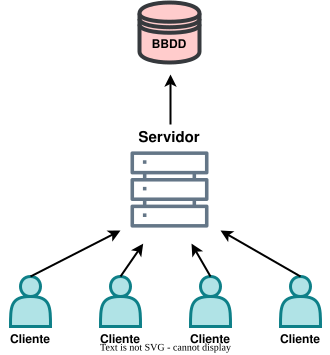
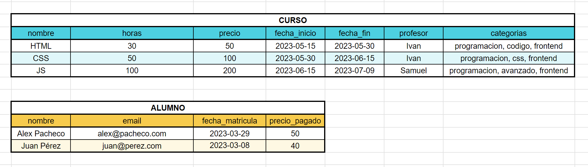
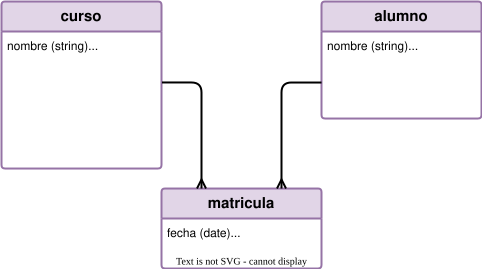
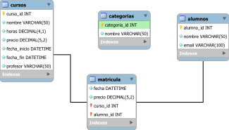
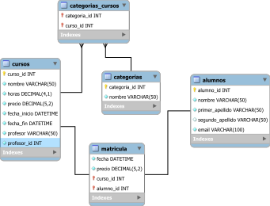
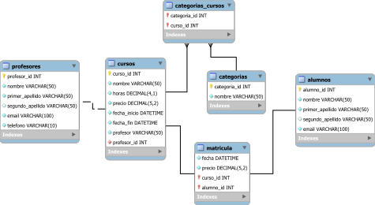

# SQL con SQLite { .font-xxxl }

---

## Conceptos básicos de bases de datos {.font-xl}

---

### ¿Qué es una base de datos? {.font-lg}

Una base de datos es un conjunto de datos que se almacenan y organizan de forma estructurada para que sean fácilmente accesibles y gestionables.

---

### Tipos de Bases de Datos {.font-lg}

1. **SQL** (Structured Query Language) o Relacionales
2. **NoSQL** o No relacionales

---

👉 **SQL (Structured Query Language) o Relacionales** {.font-lg}

- Son las bases de datos estándar, **las de toda la vida**. 
- Sirven sobre todo para cuando tenemos datos que **se relacionan entre tablas**.
- Cuando todos los registros vayan a tener los **mismos tipos de datos**.
- Cuando  necesitemos **relaciones** entre unas tablas y otras.
- La estructura es mucho más **rígida**.

---

👉 **NoSQL o No relacionales** {.font-lg}

- Están diseñadas para hacer peticiones **más rápidas**.
- Tienen **menos restricciones**.
- Cuando simplemente necesitemos guardar datos **sin necesidad de relacionar entre unos datos y otros**.
- Son más escalables y se adaptan mejor a **datos no estructurados**.
- Unos registros y otros pueden tener **distintos datos guardados**.
- Big Data

---

### Modelos de datos {.font-lg}

:::{.slide style="text-align: left; padding: 0 2.5rem;" }

👉 **Tabla →** La que contiene toda la información de cada elemento, todos los registros.
    ➡ *tareas*

👉 **Registros →** Es una colección de datos referentes a un tema. (Cada renglón o fila de la tabla)
    ➡ | 1 | Pasear a las perras | Completado |

👉 **Campos/Columnas →** Es la unidad básica de información (cada columna).
    ➡ *INTEGER, TEXT, REAL, BLOB, NULL*

👉 **Dato →** Es el valor de cada una de las celdas, la información que nos interesa guardar.
    ➡ *"Pasear a las perras"*

:::

---

#### Tipos de datos {.font-lg}

##### Lo que podemos guardar en cualquier campo de una tabla. {.font-sm}
|TIPO|DESCRIPCIÓN|
|====|===========|
|**TEXT**|Cualquier tipo de texto.|
|**INTEGER**|Números enteros sin coma.|
|**REAL**|Números decimales.|
|**NULL**|El valor *null*, es decir, nada|
|**BLOB**|Datos binarios, es decir archivos como fotos|
|**NUMERIC**|Acepta tanto enteros como decimales pero deja a SQLite que establezca el tipo ¡ojo con este!|

---

#### Tipos de datos {.font-lg}
##### ¿Puedo usar otros tipos? {.font-sm}

Sí, podemos usar otros tipos de datos, pero SQLite los convierte a su tipo real. Por ejemplo, si declaramos un campo como `VARCHAR(255)` lo convertirá a `TEXT`.

| Tipo declarado | Afinidad real |
| -------------- | ------------- |
| VARCHAR(255)   | TEXT          |
| DECIMAL        | NUMERIC       |
| BOOLEAN        | NUMERIC       |
| DATETIME       | NUMERIC       |
| FLOAT          | REAL          |
| INT            | INTEGER       |
| TINYINT        | INTEGER       |

---

### ¿Cómo trabajamos con las bases de datos de SQLite? {.font-lg}

::: { .left }
A diferencia de otras bases de datos, SQLite **no tiene un servidor al que conectarse**. En su lugar, se trabaja directamente con **un archivo** de base de datos. Este archivo puede estar en el disco duro o guardado en la nube.
:::
➡ *tareas.db*

---

### ¿Cómo vemos nuestras bases de datos? {.font-lg}

Podemos ver nuestras bases de datos usando varios programas, pero el más sencillo es **DB Browser for SQLite**. Este programa nos permite ver y editar nuestras bases de datos de forma sencilla y visual.

También podemos usar VSCode con alguna extensión. Una muy buena es **DBCode**.

---

## Antes que nada, hay que diseñar nuestra base de datos {.font-xl}

Lo primero y más importante es entender **cómo se va a organizar cada una de nuestras bases de datos**. Para ello solemos hacer una serie de pasos en los que veremos todas las necesidades que tendrá nuestra base de datos.

---

### 1. MODELO CONCEPTUAL - Entender los requerimientos {.font-lg}

---

#### **Modelo de negocio** 

:::{.left}
Lo primero que hay que hacer es **organizar** bien nuestro **modelo de negocio**, es decir, **cómo funciona nuestra empresa** y qué **tipos de datos** vamos a querer guardar y de qué forma. 

**Aquí podemos hacer algún mapa conceptual de lo que pueda contener la BBDD.**
::: 

---

**Lo pasamos a excel para ver cómo se verían nuestros datos una vez añadidos los registros.**

---

### 2. MODELO LÓGICO: {.font-lg}

- Ahora hay que sacar del modelo conceptual toda la informaciñon que vamos a necesitar para crear nuestra base de datos.
  - Entidades/Tablas
  - Atributos/Columnas
  - Llaves/Primary Key, Foreign Key, Unique
  - Relaciones entre tablas

---

#### ENTIDAD / tabla {.font-xl}

Se considera entidad a cualquier elemento de nuestro modelo de negocio 👉 nombre, persona, lugar, cosa, evento, etc. 

**Cada entidad** se convertirá en **una tabla** dentro de nuestra BBDD.

---

#### ATRIBUTOS / Columnas {.font-xl}

Cada uno de los datos que tiene una entidad. 

*Ej: nombre, email, fecha_compra, telefono, edad, esta_activo, etc.*

---

#### LLAVES {.font-xl}

Son identificadores únicos para cada columna. Nos ayudarán a relacionar las tablas entre sí.

1. **Primary Key →** Identificador único que tiene cada registro.
2. **Foreign Key →** Son las que van a permitir la relación entre una tabla y otra.
3. **Unique →** No sería una llave al uso, pero sí que es un tipo de dato que va a ser único en toda su tabla.

---

#### RELACIONES {.font-xl}

Son ese tipo de asociación que hay entre las tablas.
|     |                                |                 |
| --- | ------------------------------ | --------------- |
| 1.  | **1 a 1 (1 to 1)         👉**   | empleado ↔ DNI  |
| 2.  | **1 a Muchos (1 to N)    👉**   | pais ⇉ ciudad   |
| 3.  | **Muchos a Muchos (N to M) 👉** | alumno ⇇⇉ curso |

---

**Por último:** {.font-lg}

Al saber las relaciones que hay entre las tablas, podemos empezar a darnos cuenta de que va a haber distintos tipos de tablas. TYo lo divido en **3 tipos de tablas:**

---

##### 1. **Tabla de datos:** {.font-lg}

La que guardará todos los datos que nos interesan. 

*Una tabla **profesor** tendrá una tabla y guardará su:*

| nombre | apellidos | email              | etc. |
| ------ | --------- | ------------------ | ---- |
| Ivan   | Luengo    | ivluengo@gmail.com | --   |

---

##### 2. **Tabla de catálogo:** {.font-lg}

Guardará un listado de “tipos” y tendrá un número determinado de datos que usualmente no varía en el tiempo.  Esta entidad la relacionaremos con una tabla de datos.  

*Es la típica tabla “métodos de pago” o “tipo de usuario” en la que guardaremos los 3 o 4 tipos que hay.*

| id  | metodo_de_pago |
| --- | -------------- |
| 1   | tarjeta        |
| 2   | transferencia  |
| 3   | efectivo       |

---

##### 3. **Tabla de tipo enlace/pivote:** {.font-lg}

Es una entidad que nos sirve para relacionar unas tablas con otras. 

*Una tabla que guarde la relación entre los cursos a los que se ha matriculado cada alumno*

| id  | alumno_id | curso_id |
| --- | --------- | -------- |
| 1   | 5         | 2        |
| 2   | 3         | 2        |
| 3   | 2         | 4        |

---

**Nos hemos dado cuenta de que la relación curso > alumnos, al ser `N to N` requería una entidad intermedia llamada matrícula.**

👍

---

## FOREIGN KEY CONSTRAINTS {.font-xl}
Siempre que tengamos una **llave foránea** deberíamos añadirle unas restricciones para definir qué hacer cuando se ACTUALICE un dato o cuando se BORRE un dato de la tabla relacionada.

---

### Atributos para la Foreign Key:
* **RESTRICT** 👉 Si intentamos borrar un profesor de la BBDD, no nos va a dejar porque sabe que ese profesor está relacionado con un curso.
* **CASCADE** 👉 Si hay alguna modificación o borrado de un profe, también se va a actualizar el registro del curso o a borrar.
* **SET NULL** 👉 Si hay algún cambio, se cambiará el valor del campo `profesor_id` a null dentro de la tabla `cursos`.
* **SET DEFAULT** 👉 Si hay algún cambio, se cambiará el valor del campo `profesor_id` a un valor por defecto dentro de la tabla `cursos`.

---

### 3. MODELO FÍSICO {.font-lg}

Una vez terminado, podemos crear nuestro **modelo final**. Que será distinto dependiendo de qué tipo de base de datos usemos. 

---

<!-- En este ejemplo, una cosa que podríamos hacer en la tabla `matriculas` es generar **DOS PRIMARY KEY**, para el campo `curso_id` y para el campo `alumno_id`. Esta **CLAVE PRIMARIA COMPUESTA** nos ayuda a crear un identificador único que combine dos columnas únicas. Esto nos ayuda a que nunca un alumno pueda matricularse 2 veces en el mismo curso, porque se repetiría esa combinación. Si no queremos eso, o si en un futuro esa tabla se va a relacionar con otra, simplemente hacemos una columna `matricula_id`.  -->

## Normalización {.font-xxxl}

---

La normalización son una serie de normas que hacen que nuestras bases de datos estén mucho mejor estructuradas y con muchos menos datos redundantes. {.font-lg}

---

### 1. PRIMERA FORMA NORMAL 👉 Cada celda debería tener un solo valor indivisible y no deberíamos tener columnas repetidas. {.font-md}

 { .m-auto .w-75}

---

Por ejemplo, si quisiéramos crear una columna dentro de la tabla `cursos` que se llamara `categorias`, sería un error, primero porque habría varias categorías separadas por coma y eso es difícil de trabajar. 

| id  | nombre | horas | categorias        |
| --- | ------ | ----- | ----------------- |
| 1   | SQL    | 20    | SQL, Python, Java |
| 2   | Python | 30    | Python, SQL       |
| 3   | Java   | 40    | Java, SQL         |

❌❌❌

---

Si, en cambio, quisieramos crear 2 o 3 columnas llamadas `categoria_1`, `categoría_2`, etc. habría columnas repetidas. 

| id  | nombre | horas | categoria_1 | categoria_2 | categoria_3 |
| --- | ------ | ----- | ----------- | ----------- | ----------- |
| 1   | SQL    | 20    | SQL         | Python      | Java        |
| 2   | Python | 30    | Python      | SQL         |             |
| 3   | Java   | 40    | Java        | SQL         |

---

En este caso lo mejor es crear una **tabla de tipo catálogo** llamada `categorias`. {.font-sm}

 { .m-auto .w-50}

| id  | categoria  |
| --- | ---------- |
| 1   | SQL        |
| 2   | Python     |
| 3   | Java       |
| 4   | JavaScript |

---

El caso es que esta tabla tiene una relación **“Muchos a Muchos”** con la tabla `cursos` y eso no existe en SQL. 
En realidad, siempre que pasa esto creamos otra **tabla de enlace** como la de `matriculas`.

 {.w-60 .m-auto}

---

Además, también deberíamos separar aquellos campos que puedan ser divididios, como `nombre` en “nombre”, “apellido” o `dirección` en “calle”, “numero”, y “codigo_postal”.

  

 {.w-60 .m-auto}

---

### 2. SEGUNDA FORMA NORMAL 👉 Ninguna tabla debería tener celdas que no hablaran de "esa" y "solo esa" entidad.

En este caso, si tuviéramos un campo en la tabla `cursos` que se llamara `profesor`, acabaríamos teniendo a lo mejor varios registros con el mismo nombre del profesor porque imparte varios cursos. 

Lo suyo sería **sacarlo a otra tabla y relacionarla con esta.** Esto lo veremos siempre cuando veamos **CAMPOS REPETIDOS.**

---

| id  | nombre     | horas | profesor |
| --- | ---------- | ----- | -------- |
| 1   | SQL        | 20    | Ivan     |
| 2   | Python     | 30    | Ivan     |
| 3   | Java       | 40    | Pablo    |
| 4   | JavaScript | 50    | Ivan     |

❌❌❌

---

:::  { style="display: flex; gap: 1rem; align-items: center;" }

|Cursos ||||
| id  | nombre     | horas | profesor_id |
| --- | ---------- | :---: | :---------: |
| 1   | SQL        |  20   |      2      |
| 2   | Python     |  30   |      2      |
| 3   | Java       |  40   |     13      |
| 4   | JavaScript |  50   |      2      |

↔

|Profesores ||
|  id   | nombre |
| :---: | :----: |
|   2   |  Ivan  |
|  13   | Pablo  |

:::

✅✅✅

---

---

### 3. TERCERA FORMA NORMAL 👉 Ninguna columna en una tabla debería ser derivada de otras columnas.

Por ejemplo, si tenemos una columna `nombre` y otra columna `apellido`, no deberíamos tener otra columna llamada `nombre_completo` porque esa información ya la podemos sacar de las otras dos.

Este ejemplo también lo vemos cuando tenemos columnas que son cálculos matemáticos de otras columnas.

---

### EN RESUMEN {.font-xl}
#### Intenta no tener código repetido ni datos que no formen parte de una tabla. 

---

### Como consejo final {.font-xl}
#### INTENTA NO HACER TABLAS DE ABSOLUTAMENTE TODO {.font-lg}

(solo lo que haga falta para tu modelo de negocio)

---

## Ejercicio ejemplo 01 {.font-lg}

::: {.font-sm}
Se quiere diseñar una Base de Datos para controlar el acceso a las pistas deportivas de Zaragoza. Se tendrán en cuenta los siguientes supuestos:
* Todo aquel que quiera hacer uso de las instalaciones tendrá que registrarse y proporcionar su nombre, apellidos, email, teléfono, dni y fecha de nacimiento.
* Hay varios polideportivos en la ciudad, identificados por nombre, dirección, extensión (en m2).
* En cada polideportivo hay varias pistas de diferentes deportes. De cada pista guardaremos un código que la identifica, el tipo de pista (tenis, fútbol, pádel, etc.), si está operativa o en mantenimiento, el precio y la última vez que se reservó.
* Cada vez que un usuario registrado quiera utilizar una pista tendrá que realizar una reserva previa a través de la web que el ayuntamiento ha creado. De cada reserva queremos registrar la fecha en la que se reserva la pista, la fecha en la que se usará y el precio. Hay que tener en cuenta que todos los jugadores que vayan a hacer uso de la pista deberán estar registrados en el sistema y serán vinculados con la reserva.
:::

---

# THE END {.invisible aria-hidden="true"}
🔚 {.font-xxxl}
