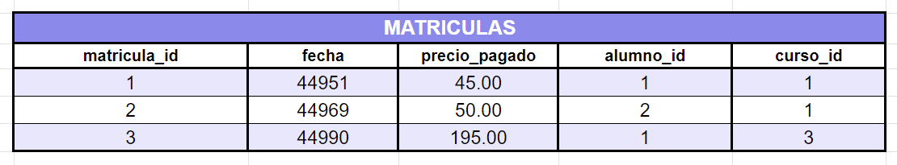

# SQL { .font-xxxl }
## Cláusulas avanzadas { .font-xl }

---

### JOINS { .font-xl }
#### Unir columnas de varias tablas { .font-lg }

---

<!-- JOINS -->

### JOINS { .font-xl }

Si observamos la tabla `matriculas`.



Vemos que tenemos alguna información pero no toda, porque tenemos muchos `id`.

Podemos hacer peticiones juntando varias tablas usando la cláusula <span class="rosa font-xl">**JOIN**</span>

---

### JOINS { .font-xl }
#### INNER JOINS { .font-lg }

---

<!-- INNER JOINS -->

### JOINS { .font-xl }

#### INNER JOINS { .font-lg }

Los `INNER JOINS` son las uniones POR DEFECTO. 

```sql
-- Seleccionar datos de la tabla matriculas y la tabla cursos.

SELECT *
FROM matriculas
INNER JOIN alumnos
    ON matriculas.alumno_id = alumnos.alumno_id;

/*
+--------------+------------+---------------+-----------+----------+-----------+--------+-----------------+------------------+-----------------+
| matricula_id | fecha      | precio_pagado | alumno_id | curso_id | alumno_id | nombre | primer_apellido | segundo_apellido | email           |
+--------------+------------+---------------+-----------+----------+-----------+--------+-----------------+------------------+-----------------+
|            1 | 2023-01-25 |         45.00 |         1 |        1 |         1 | Jorge  | López           | García           | jorge@lopez.com |
|            2 | 2023-02-12 |         50.00 |         2 |        1 |         2 | Javier | Martínez        | López            | xavi@m.com      |
|            3 | 2023-03-05 |        195.00 |         1 |        3 |         1 | Jorge  | López           | García           | jorge@lopez.com |
+--------------+------------+---------------+-----------+----------+-----------+--------+-----------------+------------------+-----------------+*/
```

---

<!-- INNER JOINS -->

### JOINS { .font-xl }

#### INNER JOINS { .font-lg }


Si tenemos alguna columna repetida en las dos tablas **TENDREMOS QUE DECIRLE DE QUÉ TABLA LO COGEMOS**.

```sql
-- Seleccionar columnas que se repiten en la tabla matriculas y la tabla cursos.

SELECT matricula_id, alumnos.alumno_id ,precio_pagado, nombre, primer_apellido
FROM matriculas
INNER JOIN alumnos
    ON matriculas.alumno_id = alumnos.alumno_id;

/*
+--------------+-----------+---------------+--------+-----------------+
| matricula_id | alumno_id | precio_pagado | nombre | primer_apellido |
+--------------+-----------+---------------+--------+-----------------+
|            1 |         1 |         45.00 | Jorge  | López           |
|            2 |         2 |         50.00 | Javier | Martínez        |
|            3 |         1 |        195.00 | Jorge  | López           |
+--------------+-----------+---------------+--------+-----------------+*/
```

---


<!-- INNER JOINS - ALIAS DE TABLA -->

### JOINS { .font-xl }

#### INNER JOINS { .font-lg }

Nos permite ponerle alias a los nombres de las tablas para que no sea tan largo. LO SOLEMOS ABREVIAR A UNA SOLA LETRA

**ALIAS DE TABLA** {.left .m-auto .w-90}

```sql
-- Abreviar los nombres de las tablas.

SELECT matricula_id, a.alumno_id ,precio_pagado, nombre, primer_apellido
FROM matriculas m
INNER JOIN alumnos a
    ON m.alumno_id = a.alumno_id;

/*
+--------------+-----------+---------------+--------+-----------------+
| matricula_id | alumno_id | precio_pagado | nombre | primer_apellido |
+--------------+-----------+---------------+--------+-----------------+
|            1 |         1 |         45.00 | Jorge  | López           |
|            2 |         2 |         50.00 | Javier | Martínez        |
|            3 |         1 |        195.00 | Jorge  | López           |
+--------------+-----------+---------------+--------+-----------------+*/
```

---

<!-- INNER JOINS - EJERCICIO 01 -->

### JOINS { .font-xl }

#### INNER JOINS { .font-lg }
<span class="rosa">**EJERCICIO 01** {.left}

::: {.left}

* Coge la tabla de `items_pedido` de la BBDD `tienda`:
  * Y la juntas con la tabla `productos`
  * Y muestra solo las columnas `pedido_id`, `producto_id`, `nombre` y `cantidad_stock`.

:::

<!-- 
SELECT pedido_id, ip.producto_id, nombre, cantidad_stock
FROM items_pedido ip
JOIN productos p
    ON ip.producto_id = p.producto_id;
 -->


---

<!-- INNER JOINS - JUNTAR MÁS DE DOS TABLAS -->

### JOINS { .font-xl }

#### INNER JOINS { .font-lg }

**JUNTAR MÁS DE DOS TABLAS** {.left .m-auto .w-90}


```sql
-- Juntar las tablas `matriculas`, `alumnos` y `cursos`.

SELECT matricula_id, precio_pagado, a.nombre AS nombre_alumno, c.nombre AS curso
FROM matriculas m
INNER JOIN alumnos a
	ON a.alumno_id = m.alumno_id
INNER JOIN cursos c
	ON c.curso_id = m.curso_id;

/*
+--------------+---------------+---------------+-------+
| matricula_id | precio_pagado | nombre_alumno | curso |
+--------------+---------------+---------------+-------+
|            1 |         45.00 | Jorge         | HTML  |
|            2 |         50.00 | Javier        | HTML  |
|            3 |        195.00 | Jorge         | JS    |
+--------------+---------------+---------------+-------+*/
```
Fíjate en que he puesto **ALIAS** a las columnas porque si no nos liamos mucho.

---

<!-- INNER JOINS - EJERCICIO 02 -->

### JOINS { .font-xl }

#### INNER JOINS { .font-lg }
<span class="rosa">**EJERCICIO 02** {.left}

::: {.left}

* Coge la tabla de `pagos` de la BBDD `facturacion`:
  * Y la juntas con la tabla `metodos_pago` y la de `clientes`
  * Y muestra solo las columnas `fecha`, `factura_id`, `cantidad`, `nombre` y `metodo_pago`.

:::

<!-- 
SELECT fecha, factura_id, cantidad, c.nombre, mp.nombre
FROM pagos p
INNER JOIN clientes c
	ON p.cliente_id = c.cliente_id
INNER JOIN metodos_pago mp
	ON p.metodo_pago = mp.metodo_pago_id;
 -->


---

### JOINS { .font-xl }
#### OUTER JOINS { .font-lg }

---

<!-- OUTER JOINS -->

### JOINS { .font-xl }

#### OUTER JOINS { .font-lg }

Cuando hacemos un **JOIN** normal, nunca se van a mostrar los resultados de aquellos registros que no cumplan una condición.


```sql
-- Juntar las tablas `matriculas`, `alumnos`.

SELECT a.alumno_id, nombre, precio_pagado
FROM alumnos a
JOIN matriculas m
	ON m.alumno_id = a.alumno_id;

/*
+-----------+--------+---------------+
| alumno_id | nombre | precio_pagado |
+-----------+--------+---------------+
|         1 | Jorge  |         45.00 |
|         2 | Javier |         50.00 |
|         1 | Jorge  |        195.00 |
+-----------+--------+---------------+*/
```
Yo sé que hay un alumno más que no aparece porque no cumple la condición de que `ON m.alumno_id = a.alumno_id`. {.font-sm}

---

<!-- OUTER JOINS -- LEFT JOIN -->

### JOINS { .font-xl }

#### OUTER JOINS { .font-lg }

**LEFT JOIN** {.left .m-auto .w-90}

```sql
-- Juntar las tablas `matriculas`, `alumnos` mostrando 
-- todos los datos de la tabla de la "izquierda" (la primera tabla).

SELECT a.alumno_id, nombre, precio_pagado
FROM alumnos a
LEFT JOIN matriculas m
	ON m.alumno_id = a.alumno_id;

/*
+-----------+--------+---------------+
| alumno_id | nombre | precio_pagado |
+-----------+--------+---------------+
|         1 | Jorge  |        195.00 |
|         1 | Jorge  |         45.00 |
|         2 | Javier |         50.00 |
|         3 | Sarah  |          NULL |
+-----------+--------+---------------+*/
```
La versión **RIGHT JOIN** hace exactamente lo mismo, pero cogiendo los datos de la "derecha" (la segunda tabla).

---

<!-- OUTER JOINS -- LEFT JOIN -->

### JOINS { .font-xl }

#### CLAUSULA <span class="emoticono">👉</span> <span class="rosa">USING</span> { .font-lg }

Si coincide que hacemos un **JOIN** y que las dos columnas por las que queremos juntar las tablas se llaman igual, podemos usar la cláusila **USING** en su lugar.

```sql
-- Juntar las tablas `matriculas` y `alumnos`

SELECT a.alumno_id, nombre, precio_pagado
FROM alumnos a
LEFT JOIN matriculas m
	USING (alumno_id);

/*
+-----------+--------+---------------+
| alumno_id | nombre | precio_pagado |
+-----------+--------+---------------+
|         1 | Jorge  |        195.00 |
|         1 | Jorge  |         45.00 |
|         2 | Javier |         50.00 |
|         3 | Sarah  |          NULL |
+-----------+--------+---------------+*/
```

---

### UNIONS { .font-xl }
#### Unir filas de varias tablas { .font-lg }

---

<!-- UNIONS -->

### UNIONS { .font-xl }

Podemos unir más filas de otras tablas si combinamos una **QUERY** con otra usando la cláusila **UNION**
```sql
-- Añadir las filas de la tabla `alumnos` a las de la tabla `profesores`

SELECT nombre, primer_apellido
FROM profesores
UNION
SELECT nombre, primer_apellido
FROM alumnos;

/*
+--------+-----------------+
| nombre | primer_apellido |
+--------+-----------------+
| Ivan   | Luengo          |
| Samuel | Rodríguez       |
| Berto  | Yanez           |
| Juan   | Perez           |
| Pedro  | Garcia          |
| Maria  | López           |
+--------+-----------------+*/
```

---

<!-- UNIONS -->

### UNIONS { .font-xl }

Por ejemplo, podemos unir la misma tabla varias veces añadiendo una columna extra que defina u estado distinto para cada unión. {.font-sm}

Ej: Todos los `pedidos` que sean de este año que tengan un estado `ACTIVO` y todos los pedidos anteriores que tengan un estado `ANTIGUO` {.font-sm}

```sql
-- Duplicar las filas de la tabla `productos`.

SELECT pedido_id, fecha_pedido, 'ACTIVO' AS estado
FROM pedidos
WHERE fecha_pedido >= '2023-01-01'
UNION
SELECT pedido_id, fecha_pedido, 'ANTIGUO' AS estado
FROM pedidos
WHERE fecha_pedido < '2023-01-01'
LIMIT 3;

/*
+-----------+--------------+---------+
| pedido_id | fecha_pedido | estado  |
+-----------+--------------+---------+
|         1 | 2023-01-30   | ACTIVO  |
|         2 | 2022-08-02   | ANTIGUO |
|         3 | 2021-12-01   | ANTIGUO |
+-----------+--------------+---------+*/
```

---

<!-- UNIONS - EJERCICIO 01 -->

### UNIONS { .font-xl }

<span class="rosa">**EJERCICIO 01** {.left}

::: {.left}

* Coge la tabla de `consumidores` de la BBDD `tienda`:
  * Y usando **UNIONS** muestra las columnas `nombre`, `apellidos`, `ciudad`, `puntos` y una columna extra que defina si el consumidor es de tipo **ORO**, **PLATA**, **BRONCE** o **NORMAL**.
  * Si tiene más de 3000 puntos será **ORO**
  * Si tiene más de 2000 puntos será **PLATA**
  * Si tiene más de 1000 puntos será **BRONCE**
  * Si tiene menos de 1000 puntos será **NORMAL**
:::

<!-- 
SELECT nombre, apellidos, ciudad, puntos, 'ORO' AS tipo_cliente 
FROM consumidores
WHERE puntos > 3000
UNION
SELECT nombre, apellidos, ciudad, puntos, 'PLATA' 
FROM consumidores
WHERE puntos BETWEEN 2000 AND 3000
UNION
SELECT nombre, apellidos, ciudad, puntos, 'BRONCE' 
FROM consumidores
WHERE puntos BETWEEN 1000 AND 2000
UNION
SELECT nombre, apellidos, ciudad, puntos, 'NORMAL' 
FROM consumidores
WHERE puntos < 1000;
 -->

---

### Funciones de Agregación { .font-xl }
#### MAX( ) MIN( ) { .font-lg }
#### SUM( ) AVG( ) { .font-lg }
#### COUNT ( ) { .font-lg }

---

<!-- AGREGATE FUNCTIONS -- MAX () -->

### Funciones de Agregación { .font-xl }

#### FUNCIÓN <span class="emoticono">👉</span> <span class="rosa">MAX( )</span> { .font-lg }

De todas los registros de una tabla, te devuelve el más **GRANDE**.

```sql
-- Valor más alto de la tabla de `facturas`.

SELECT MAX(factura_total) AS factura_mas_alta
FROM facturas;

/*
+------------------+
| factura_mas_alta |
+------------------+
|           189.12 |
+------------------+*/
```

---

<!-- AGREGATE FUNCTIONS -- MIN () -->

### Funciones de Agregación { .font-xl }

#### FUNCIÓN <span class="emoticono">👉</span> <span class="rosa">MIN( )</span> { .font-lg }

De todas los registros de una tabla, te devuelve el más **PEQUEÑO**.

```sql
-- Valor más bajo de la tabla de `facturas`.

SELECT MIN(factura_total) AS factura_mas_baja
FROM facturas;

/*
+------------------+
| factura_mas_baja |
+------------------+
|           101.79 |
+------------------+*/
```

---

<!-- AGREGATE FUNCTIONS -- SUM () -->

### Funciones de Agregación { .font-xl }

#### FUNCIÓN <span class="emoticono">👉</span> <span class="rosa">SUM( )</span> { .font-lg }

Suma todos los registros de esa columna.

```sql
-- Valor total de todas las `facturas`.

SELECT SUM(factura_total) AS facturacion_total
FROM facturas;

/*
+-------------------+
| facturacion_total |
+-------------------+
|           2590.60 |
+-------------------+*/
```

---

<!-- AGREGATE FUNCTIONS -- AVG () -->

### Funciones de Agregación { .font-xl }

#### FUNCIÓN <span class="emoticono">👉</span> <span class="rosa">AVG( )</span> { .font-lg }

Calcula la media de todos los valores de la columna.

```sql
-- Valor medio de todas las `facturas`.

SELECT AVG(factura_total) AS facturacion_media
FROM facturas;

/*
+-------------------+
| facturacion_media |
+-------------------+
|        152.388235 |
+-------------------+*/
```

---

<!-- AGREGATE FUNCTIONS -- COUNT () -->

### Funciones de Agregación { .font-xl }

#### FUNCIÓN <span class="emoticono">👉</span> <span class="rosa">COUNT( )</span> { .font-lg }

Cuenta el número de registros de una columna.

```sql
-- Cuantas facturas hay..

SELECT count(factura_total) AS numero_de_facturas
FROM facturas;

/*
+--------------------+
| numero_de_facturas |
+--------------------+
|                 17 |
+--------------------+*/
```
¡Ojo! porque solo contará los registros que tengan valor, no los que tengan **null**. Así que para contar todos los registros habrá que usar <span class="rosa">**COUNT(*)**</span> {.font-sm}

---

<!-- AGREGATE FUNCTIONS -- RESUMEN -->

### Funciones de Agregación { .font-xl }

#### <span class="rosa">RESUMEN</span> { .font-lg }


```sql
SELECT 
    MAX(factura_total)   AS mas_alta,
    MIN(factura_total)   AS mas_baja,
    SUM(factura_total)   AS facturacion_total,
    AVG(factura_total)   AS factura_media,
    count(factura_total) AS numero_de_facturas
FROM facturas;

/*
+----------+----------+-------------------+---------------+--------------------+
| mas_alta | mas_baja | facturacion_total | factura_media | numero_de_facturas |
+----------+----------+-------------------+---------------+--------------------+
|   189.12 |   101.79 |           2590.60 |    152.388235 |                 17 |
+----------+----------+-------------------+---------------+--------------------+*/

```

---

### Agrupar agregaciones { .font-xl }
#### GROUP BY { .font-lg }

---

<!-- Agrupar agregaciones -- GROUP BY -->

### Agrupar agregaciones { .font-xl }

#### CLÁUSULA <span class="emoticono">👉</span> <span class="rosa">GROUP BY</span> { .font-lg }

Cuando usamos `funciones de agregación` podemos decirle a SQL que esa agregación la haga por cada uno de los valores de una columna. Por ejemplo: Hazme la suma total de las facturas DE CADA USUARIO.

```sql
-- Cuanto ha gastado cada cliente.

SELECT cliente_id, SUM(factura_total) AS total_cliente
FROM facturas
GROUP BY cliente_id;

/*
+------------+---------------+
| cliente_id | total_cliente |
+------------+---------------+
|          1 |        802.89 |
|          2 |        101.79 |
|          3 |        705.90 |
|          5 |        980.02 |
+------------+---------------+*/
```

---

### Agrupar agregaciones { .font-xl }
#### GROUP BY { .font-lg }
#### HAVING { .font-lg }

---

<!-- Agrupar agregaciones -- GROUP BY -->

### Agrupar agregaciones { .font-xl }

#### CLÁUSULA <span class="emoticono">👉</span> <span class="rosa">HAVING</span> { .font-lg }

Una vez hemos agrupado algo usando <span class="lila">**GROUP BY**</span>, podemos filtrar los resultados que da esa agrupación, **pero no podemos usar el <span class="lila">WHERE</span>**, necesitamos usar el <span class="lila u">**HAVING**</span>

```sql
-- Cuanto ha gastado cada cliente, y solo muestra los que han gastado más de 300.

SELECT cliente_id, SUM(factura_total) AS total_cliente
FROM facturas
GROUP BY cliente_id
HAVING total_cliente > 300;

/*
+------------+---------------+
| cliente_id | total_cliente |
+------------+---------------+
|          1 |        802.89 |
|          3 |        705.90 |
|          5 |        980.02 |
+------------+---------------+*/
```

---

<!-- Agrupar agregaciones -- GROUP BY -->

### OJO CON EL ORDEN OTRA VEZ { .font-xl }


A riesgo de parecer cansino, me gustaría repetir que mucho cuidado con el orden de las cláusulas.

```sql

SELECT 
    factura_id, 
    factura_total, 
    pago_total, 
    factura_fecha, 
    nombre,
    ciudad,
    SUM(factura_total) AS total_por_cliente
FROM facturas
JOIN clientes USING (cliente_id)
WHERE factura_fecha BETWEEN '2019-01-01' AND '2019-05-31'
GROUP BY nombre
HAVING pago_total > 0
ORDER BY pago_total
LIMIT 1;

/*
+------------+---------------+------------+---------------+--------+---------+-------------------+
| factura_id | factura_total | pago_total | factura_fecha | nombre | ciudad  | total_por_cliente |
+------------+---------------+------------+---------------+--------+---------+-------------------+
|         18 |        180.17 |      42.77 | 2019-05-23    | Susana | Llança  |            180.17 |
+------------+---------------+------------+---------------+--------+---------+-------------------+*/
```

---

<!-- AGRUPACIONES - EJERCICIO 01 -->

### AGRUPACIONES { .font-xl }

<span class="rosa">**EJERCICIO 01** {.left}

::: {.left}

* Coge la tabla de `consumidores` de la BBDD `tienda`:
  * Genera un listado de las puntuaciones más altas **POR COMUNIDAD AUTÓNOMA**.
  * Ordena el resultado por puntos <span class="u">de mayor a menor</span>.
  * Muestra solo los resultados que tengan <span class="u">más de 1000 puntos</span>.
:::

<!-- 
SELECT comunidad_autonoma, MAX(puntos) AS puntos_maximos
FROM consumidores
GROUP BY comunidad_autonoma
HAVING puntos_maximos > 1000
ORDER BY puntos_maximos DESC;
 -->


---


### SUBCONSULTAS { .font-xl }
#### Buscar algo utilizando más de un SELECT { .font-lg }

---

<!-- SUBCONSULTAS -->

### SUBCONSULTAS { .font-xl }


A veces tenemos que hacer consultas que son más complejas y necesitamos utilizar la cláusula <span class="rosa">**SELECT**</span> más veces. Veamos un ejemplo. {.font-sm}

Ej: Busca todos los cursos que sean más caros **que el curso de CSS** {.font-sm}
DIVIDE EL PROBLEMA EN VARIOS PROBLEMILLAS {.font-sm}

1. ¿Cuánto vale el curso de CSS? {.lila .font-sm}

```sql
-- Cuanto vale el curso de CSS.

SELECT precio
FROM cursos
WHERE curso_id = 2;

/*
+--------+
| precio |
+--------+
|  50.00 |
+--------+*/
```


---

<!-- SUBCONSULTAS -->

### SUBCONSULTAS { .font-xl }

Ej: Busca todos los cursos que sean más caros **que el curso de CSS** {.font-sm}
DIVIDE EL PROBLEMA EN VARIOS PROBLEMILLAS {.font-sm}

2. ¿Cómo obtengo todos los cursos más caros de 50? {.lila .font-sm}

```sql
-- Cursos más caros de 50.

SELECT curso_id, nombre, precio
FROM cursos
WHERE precio > 50;

/*
+----------+---------+--------+
| curso_id | nombre  | precio |
+----------+---------+--------+
|        4 | JS      | 200.00 |
|        5 | Node.js | 250.00 |
+----------+---------+--------+*/
```
---

<!-- SUBCONSULTAS -->

### SUBCONSULTAS { .font-xl }

Ej: Busca todos los cursos que sean más caros **que el curso de CSS** {.font-sm}
DIVIDE EL PROBLEMA EN VARIOS PROBLEMILLAS {.font-sm}

3. Mezcla los dos resultados poniendo todo el <span class="rosa">**SELECT**</span> en el lugar del `50` {.lila .font-sm}

```sql
-- Cursos más caros de 50.

SELECT curso_id, nombre, precio
FROM cursos
WHERE precio > (
    SELECT precio
    FROM cursos
    WHERE curso_id = 2
);

/*
+----------+---------+--------+
| curso_id | nombre  | precio |
+----------+---------+--------+
|        4 | JS      | 200.00 |
|        5 | Node.js | 250.00 |
+----------+---------+--------+*/
```
🛀 **¡EUREKA!**

---


<!-- SUBCONSULTAS - EJERCICIO 01 -->

### SUBCONSULTAS { .font-xl }

<span class="rosa">**EJERCICIO 01** {.left}

::: {.left}

* Coge la tabla de `matriculas` de la BBDD `escuela`:
  * Y muestra los alumnos que NO SE HAN MATRICULADO A NADA
:::

<!-- 
SELECT *
FROM alumnos
WHERE alumno_id NOT IN (
	SELECT DISTINCT alumno_id 
	FROM matriculas
);
 -->


---

### Funciones de SQLite { .font-xl }
#### Son Gratis { .font-lg }

---

<!-- Funciones de SQLite -->

### Funciones de SQLite { .font-xl }

SQLite viene con un montón de funciones que puedes utilizar para solucionarte la vida. Veamos unas cuantas. {.font-md}

---

# Funciones para Números

---

<!-- Funciones de SQLite - ROUND -->

### Funciones de SQLite { .font-xl }
#### Números <span class="emoticono">👉</span> <span class="rosa">ROUND( )</span> { .font-lg }

* Redondea un número de forma natural.
* Permite 2 parámetros, el número que quieres redondear, y cuantos decimales quieres.

```sql
-- Redondeos del número 5.7654.

SELECT ROUND(5.7654), ROUND(5.7654, 1), ROUND(5.7654, 2), ROUND(5.7654, 3);

/*
+---------------+------------------+------------------+------------------+
| ROUND(5.7654) | ROUND(5.7654, 1) | ROUND(5.7654, 2) | ROUND(5.7654, 3) |
+---------------+------------------+------------------+------------------+
|             6 |              5.8 |             5.77 |            5.765 |
+---------------+------------------+------------------+------------------+*/
```


---

<!-- Funciones de SQLite - CEILING -->

### Funciones de SQLite { .font-xl }
#### Números <span class="emoticono">👉</span> <span class="rosa">CEILING( )</span> { .font-lg }

* Redondea al alza SIEMPRE.

```sql
-- Redondeo al alza.

SELECT CEILING(5.1), CEILING(5.9);

/*
+--------------+--------------+
| CEILING(5.1) | CEILING(5.9) |
+--------------+--------------+
|            6 |            6 |
+--------------+--------------+*/
```


---

<!-- Funciones de SQLite - FLOOR -->

### Funciones de SQLite { .font-xl }
#### Números <span class="emoticono">👉</span> <span class="rosa">FLOOR( )</span> { .font-lg }

* Redondea a la baja SIEMPRE.

```sql
-- Redondeo a la baja.

SELECT FLOOR(5.1), FLOOR(5.9);

/*
+------------+------------+
| FLOOR(5.1) | FLOOR(5.9) |
+------------+------------+
|          5 |          5 |
+------------+------------+*/
```


---

<!-- Funciones de SQLite - ABS -->

### Funciones de SQLite { .font-xl }
#### Números <span class="emoticono">👉</span> <span class="rosa">ABS( )</span> { .font-lg }

* Sirve para obtener el valor absoluto de un número. Es decir, sin el signo.

```sql
-- Números sin signo.

SELECT ABS(-23), ABS(23);

/*
+----------+---------+
| ABS(-23) | ABS(23) |
+----------+---------+
|       23 |      23 |
+----------+---------+*/
```


---

<!-- Funciones de SQLite - RANDOM -->

### Funciones de SQLite { .font-xl }
#### Números <span class="emoticono">👉</span> <span class="rosa">RANDOM( )</span> { .font-lg }

* Devuelve un número aleatorio entre -9223372036854775808 y +9223372036854775807.

```sql
-- Números aleatorios.

SELECT RANDOM(), RANDOM(), RANDOM();

/*  +--------------------+---------------------+-------------------+
    | RANDOM()           | RANDOM()            | RANDOM()          |
    +--------------------+---------------------+-------------------+
    | 502213239076796700 | -35725780108435660  | 11593995696926917 |
    +--------------------+---------------------+-------------------+  */
```
---

# Funciones para STRINGS

---

<!-- Funciones de SQLite - LENGTH -->

### Funciones de SQLite { .font-xl }
#### SRINGS <span class="emoticono">👉</span> <span class="rosa">LENGTH( )</span> { .font-lg }

* Devuelve la longitud del valor.

```sql
-- Longitudes.

SELECT LENGTH('hola'), LENGTH('zapato'), LENGTH(2);

/*
+----------------+------------------+-------------+
| LENGTH('hola') | LENGTH('zapato') | LENGTH(2)   |
+----------------+------------------+-------------+
|              4 |                6 |           1 |
+----------------+------------------+-------------+*/
```

---

<!-- Funciones de SQLite - UPPER -->

### Funciones de SQLite { .font-xl }
#### SRINGS <span class="emoticono">👉</span> <span class="rosa">UPPER( )</span> { .font-lg }

* Transforma a mayúsculas.

```sql
-- Todo en mayúsculas. 🥳

SELECT UPPER('Hola'), UPPER('Zapato'), UPPER(2);

/*
+---------------+-----------------+----------+
| UPPER('Hola') | UPPER('Zapato') | UPPER(2) |
+---------------+-----------------+----------+
| HOLA          | ZAPATO          | 2        |
+---------------+-----------------+----------+*/
```

---

<!-- Funciones de SQLite - LOWER -->

### Funciones de SQLite { .font-xl }
#### SRINGS <span class="emoticono">👉</span> <span class="rosa">LOWER( )</span> { .font-lg }

* Transforma a minúsculas.

```sql
-- Todo en minúsculas. 🤪

SELECT LOWER('Hola'), LOWER('ZAPATO'), LOWER(2);

/*
+---------------+-----------------+----------+
| LOWER('hola') | LOWER('zapato') | LOWER(2) |
+---------------+-----------------+----------+
| hola          | zapato          | 2        |
+---------------+-----------------+----------+*/
```

---

<!-- Funciones de SQLite - TRIM -->

### Funciones de SQLite { .font-xl }
#### SRINGS <span class="emoticono">👉</span> <span class="rosa">TRIM( )</span> { .font-lg }

* **LTRIM** recorta los espacios al principio.
* **RTRIM** recorta los espacios al final.
* **TRIM** recorta los espacios en blancos al principio y al final.

```sql
-- A recortar espacios. ✂

SELECT LTRIM('   hola   '), RTRIM('   hola   '), TRIM('   hola   ');

/*
+---------------------+---------------------+--------------------+
| LTRIM('   hola   ') | RTRIM('   hola   ') | TRIM('   hola   ') |
+---------------------+---------------------+--------------------+
| 'hola   '           | '   hola'           | 'hola'             |
+---------------------+---------------------+--------------------+*/
```

---


<!-- Funciones de SQLite - CONCAT -->

### Funciones de SQLite { .font-xl }
#### SRINGS <span class="emoticono">👉</span> <span class="rosa">CONCAT( )</span> { .font-lg }

* Sirve para concatenar los valores que pongamos dentro del **CONCAT** separados por coma.

```sql
-- Concatenando voy...

SELECT CONCAT('hola', ' ', 'amig@');

/*
+------------------------------+
| CONCAT('hola', ' ', 'amig@') |
+------------------------------+
| hola amig@                   |
+------------------------------+*/
```
Con este podríamos hacer cosas tipo tener un nombre completo o dirección completa mezclando varias columnas.

---

# Funciones para FECHAS

---

<!-- Funciones de SQLite - NOW() -->

### Funciones de SQLite { .font-xl }
#### SRINGS { .font-lg }
#### <span class="rosa">DATETIME('now'), DATE('now'), TIME('now')</span> { .font-md }

* Generan fechas automaticamente para AHORA MISMO:
  * **DATETIME('now')** devuelve la fecha y hora actual.
  * **DATE('now')** devuelve la fecha actual.
  * **TIME('now')** devuelve la hora actual.

```sql
-- Tic tac......

SELECT DATETIME('now'), DATE('now'), TIME('now');

/*
+---------------------+------------+-------------+
| DATETIME('now')     | DATE('now')| TIME('now') |
+---------------------+------------+-------------+
| 2023-08-01 18:24:48 | 2023-08-01 | 18:24:48    |
+---------------------+------------+-------------+*/
```

---

<!-- Funciones de SQLite - STRFTIME() -->

### Funciones de SQLite { .font-xl }
#### SRINGS { .font-lg }
#### <span class="rosa">STRFTIME( )</span> { .font-md }

* Extrae el año, mes o día de una fecha. 

```sql
-- Tic tac......

SELECT 
  STRFTIME('%Y', '2023-12-30'), -- 2023
  STRFTIME('%m','now'),         -- 08
  STRFTIME('%d', 'now'),        -- 01
  STRFTIME('%w', 'now');        -- 2 (Lunes = 0, Martes = 1, Miércoles = 2...)


```

---


<!-- Funciones de SQLite - EJEMPLO YEAR() -->

### Funciones de SQLite { .font-xl }
#### SRINGS { .font-lg }
#### <span class="rosa">Ejemplo con YEAR( )</span> { .font-md }

Si quisieras obtener todos los pedidos del año anterior y que siempre sea el anterior al actual, podríamos hacer lo siguiente. 

```sql
-- Obtener los pedidos del año anterior.
SELECT * 
FROM matriculas 
WHERE STRFTIME('%Y', date) = STRFTIME('%Y' , 'now') - 1;

/*
+--------------+---------------------+---------------+-----------+----------+
| matricula_id | fecha               | precio_pagado | alumno_id | curso_id |
+--------------+---------------------+---------------+-----------+----------+
|            5 | 2024-09-15 00:00:00 |        200.00 |         5 |        5 |
+--------------+---------------------+---------------+-----------+----------+*/
```

---

<!-- Funciones de SQLite - DATE_ADD -->

### Funciones de SQLite { .font-xl }
#### FECHAS <span class="emoticono">👉</span> <span class="rosa">DATE('fecha' , 'intervalo'  )</span> { .font-lg }

* Sirve para añadir o quitar tiempo a una fecha.

```sql
-- Cambiando calendarios. 📆

SELECT DATE('2015-05-12', '+1 day'), DATE('2015-05-12', '+2 year');

/*
+---------------------------------+-------------------------------+
| DATE('2015-05-12', '+1 day')    | DATE('2015-05-12', '+2 year') |
+---------------------------------+-------------------------------+
| 2015-05-13                      | 2017-05-12                    |
+---------------------------------+-------------------------------+*/
```

---

# THE END {.invisible aria-hidden="true"}
🔚 {.font-xxxl}
