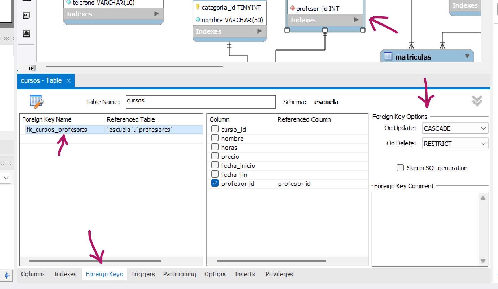

# Temario SQL

## Conceptos básicos de bases de datos

### ¿Qué es una base de datos?

Una **base de datos** es un conjunto de información relacionada, almacenada sistemáticamente en forma organizada en un medio electrónico.


### Tipos de Bases de Datos

👉 **SQL (Structured Query Language) o Relacionales**

Son las bases de datos estándar, las de toda la vida. 

Sirven sobre todo para cuando tenemos datos que se relacionan entre tablas.

- Cuando todos los registros vayan a tener los mismos tipos de datos.
- Cuando  necesitemos relaciones entre unas tablas y otras.
- La estructura es mucho más rígida.

👉 **NoSQL o No relacionales**

Están diseñadas para hacer peticiones más rápidas.

Tienen menos restricciones.

- Cuando simplemente necesitemos guardar datos sin necesidad de relacionar entre unos datos y otros.
- Son más escalables y se adaptan mejor a datos no estructurados.
- Unos registros y otros pueden tener distintos datos guardados.
- Big Data

### Modelos de datos

👉 **Tabla →** La que contiene toda la información de cada elemento, todos los registros.

👉 **Registros →** Es una colección de datos referentes a un tema. (Cada renglón o fila de la tabla)

👉 **Campos/Columnas →** Es la unidad básica de información (cada columna).

👉 **Dato →** Es el valor de cada una de las celdas, la información que nos interesa guardar.

**Hay varios tipos de campos**

- VARCHAR, DECIMAL, BOOLEAN, DATETIME, etc.

### ¿Cómo vemos nuestras bases de datos? SGBD

Visualizamos y modificamos los datos usando un SGBD o sistema Gestor de Bases de Datos.

---

## Diseño de una base de datos

Lo primero y más importante es entender cómo se va a organizar cada una de nuestras bases de datos. Para ello solemos hacer una serie de pasos en los que veremos todas las necesidades que tendrá nuestra base de datos.

### 1. MODELO CONCEPTUAL - Entender los requerimientos

👉 **Modelo de negocio →** Lo primero que hay que hacer es organizar bien nuestro modelo de negocio, es decir, cómo funciona nuestra empresa y qué tipos de datos vamos a querer guardar y de qué forma. 

**Aquí podemos hacer algún mapa conceptual de lo que pueda contener la BBDD.**


**Lo pasamos a excel para ver cómo se verían nuestros datos una vez añadidos los registros.**


### 2. MODELO LÓGICO - Hacer los cambios necesarios al revisar lo siguiente

👉 **Entidad →** Se considera entidad a cualquier elemento del tipo (nombre, persona, lugar, cosa o evento). Cada entidad se convertirá en una tabla dentro de nuestra BBDD.

**3 tipos de entidades/tablas**

1. **Entidad de datos:** La que guardará todos los datos que nos interesan. *Una tabla profesor tendrá una tabla y guardará su nombre, apellidos, email, etc.*
2. **Entidad de tipo catálogo:** Guardará un listado de “tipos” y tendrá un número determinado de datos que usualmente no varía en el tiempo.  Esta entidad la relacionaremos con una tabla de datos.  *Es la típica tabla “métodos de pago” o “tipo de usuario” en la que guardaremos los 3 o 4 tipos usuario que hay.*
3. **Entidad de tipo enlace/pivote:** Es una entidad que nos sirve para relacionar unas tablas con otras. TODO ejemplo

👉 **Atributos →** Son cada uno de los tipos de datos que tiene una entidad. *Ej: nombre, email, fecha_compra, telefono, edad, Esta_activo, etc.*

👉 **Llaves →** Son identificadores únicos para los registros

1. **Primarias (PK) →** Identificador único que tiene cada registro.
2. **Foráneas →** Son las que van a permitir la relación entre una entidad y otra
3. **Únicas →** No sería una llave al uso, pero sí que es un tipo de dato que va a ser único en toda su tabla.

👉 **Relaciones →** Son ese tipo de asociación que hay entre las entidades.

1. **1 a 1 (1 to 1) →** empleado > huella_dactilar
2. **1 a M (1 to N) →** pais > ciudad
3. **M a M (N to N) →** alumno > curso

**Nos hemos dado cuenta de que curso > alumnos requería una tabla intermedia.**


### 3. MODELO FÍSICO - Una vez terminado, podemos crear modelo físico, que lo podríamos hacer tanto con diagramas como creando tablas directamente.


Cuando se haga la relación primero hay que marcar la tabla que va a contener la Foreign Key, y que siempre debería ser la que es “a muchos”. Y luego marcar la tabla de donde viene el ID de la relación.

En este ejemplo, una cosa que podríamos hacer en la tabla `matriculas` es generar **DOS PRIMARY KEY**, para el campo `curso_id` y para el campo `alumno_id`. Esta **CLAVE PRIMARIA COMPUESTA** nos ayuda a crear un identificador único que combine dos columnas únicas. Esto nos ayuda a que nunca un alumno pueda matricularse 2 veces en el mismo curso, porque se repetiría esa combinación. Si no queremos eso, o si en un futuro esa tabla se va a relacionar con otra, simplemente hacemos una columna `matricula_id`. 

## Normalización

La normalización son una serie de normas que hacen que nuestras bases de datos estén mucho mejor estructuradas y con muchos menos datos redundantes.

### 1. PRIMERA FORMA NORMAL → Cada celda debería tener un solo valor indivisible y no deberíamos tener columnas repetidas.**

Por ejemplo, si quisiéramos crear una columna dentro de la tabla `cursos` que se llamara `categorias`, sería un error, primero porque habría varias categorías separadas por coma y eso es difícil de trabajar. Si en su caso quisieramos crear 2 o 3 columnas llamadas `categoria_1`, `categoría_2`, etc. habría columnas repetidas. En este caso lo mejor es crear una **tabla de tipo catálogo** llamada `categorias`. 


El caso es que esta tabla tiene una relación “Muchos a Muchos” y eso no existe en SQL. En realidad siempre que pasa esto creamos otra **tabla de enlace** como la de `matriculas`.


Además, también deberíamos separar aquellos campos que puedan ser divididios, como `nombre` en “nombre”, “apellido” o `dirección` en “calle”, “numero”, y “codigo_postal”.

  


### 2. SEGUNDA FORMA NORMAL → Ninguna tabla debería tener celdas que no hablaran de esa y solo esa entidad.

En este caso, si tuviéramos un campo en la tabla `cursos` que se llamara `profesor`, acabaríamos teniendo a lo mejor varios registros con el mismo nombre del profesor porque se imparte varios cursos. Lo suyo sería **sacarlo a otra tabla y relacionarla con esta.** Esto lo veremos siempre cuando veamos **CAMPOS REPETIDOS.**


### 3. TERCERA FORMA NORMAL → Ninguna columna en una tabla debería ser derivada de otras columnas.

Por ejemplo, si tenemos una columna `nombre` y otra columna `apellido`, no deberíamos tener otra columna llamada `nombre_completo` porque esa información ya la podemos sacar de las otras dos, además, si tuviéramos que cambiar el nombre o el apellido por alguna razón, tendríamos también que cambiar el nombre completo. Este ejemplo también lo vemos cuando tenemos columnas que son cálculos matemáticos de otras columnas.

### EN RESUMEN → Intenta no tener código repetido ni datos que no formen parte de una tabla. Como consejo final → INTENTA NO MODELAR EL MUNDO ENTERO (solo lo que haga falta para tu modelo de negocio)

---

## FOREIGN KEY CONSTRAINS

Siempre que tengamos una **clave foránea** deberíamos añadirle unas restricciones para definir qué hacer cuando se ACTUALICE un dato o cuando se BORRE un dato de la tabla relacionada.



- **RESTRICT** → Si intentamos borramos un profesor de la BBDD, **NO NOS VA A DEJAR** porque sabe que ese profesor está relacionado con un curso.
- **CASCADE** → Si hay alguna modificación o borrado de un profe, también se va a actualizar el registro del curso o a borrar.
- **SET NULL** → Si hay algún cambio, se cambiará el valor del campo `profesor_id` a null dentro de la tabla `cursos`.
- **NO ACTION** → Es exactamente lo mismo que **RESTRICT**.

---

## Pasar el modelo a tablas → Forward engineering

Si queremos pasar nuestro dibujo a tablas en MySQL podemos pulsar en **Database → Forward Engineer…** y seguir todos los pasos para hacer el cambio.

**A partir de entonces, si queremos hacer algún cambio directamente en nuestro diagrama, lo actualizaremos pulsando en** *Database → Synchronize Model…*

**Si queremos hacer el paso inverso, lo podemos hacer primero teniendo las tablas creadas y luego pulsando en** *Database → Reverse Engineer…*

---

## Crear nuestra base de datos usando comandos SQL

**BASES DE DATOS**

```sql
--CREAR BASE DE DATOS
CREATE DATABASE escuela;

--CREAR BASE DE DATOS SI NO EXISTE YA
CREATE DATABASE IF NOT EXISTS escuela;

--Activar una base de datos para usarla
USE escuela;

--BORRAR UNA BASE DE DATOS
DROP DATABASE escuela;

--BORRAR UNA BASE DE DATOS SI EXISTE
DROP DATABASE IF EXISTS escuela;
```


**TABLAS**

Atributos:

+ PRIMARY KEY -> Para establecer una llave primaria en ese campo.
+ AUTO_INCREMENT -> Para decirle a SQL que se encargue de añadir ese campo de forma incremental automáticamente.
+ NOT NULL -> Para no permitir que el campo quede vacío. Hay que insertar datos obligatoriamente.
+ UNIQUE -> Para restringir la posibilidad de que haya dos registros con el mismo campo.
+ DEFAULT <valor> -> Para definir un valor por defecto si no se ha establecido uno al añadir el registro.

```sql
--CREAR TABLA
CREATE TABLE nombre_tabla (.......);
CREATE TABLE IF NOT EXISTS nombre_tabla (.......);

--Ejemplo -> CREATE TABLE nombre_tabla ( nombre_columna TIPO ATRIBUTO1 ATRIBUTO2 );
CREATE TABLE alumnos (
		alumno_id INT PRIMARY KEY AUTO_INCREMENT,
		nombre VARCHAR(50) NOT NULL,
		primer_apellido VARCHAR(50) NOT NULL,
		segundo_apellido VARCHAR(50),
		email VARCHAR(100) NOT NULL UNIQUE
);

--CAMBIAR TABLA
ALTER TABLE alumnos
	ADD nota TINYINT DEFAULT 5 AFTER email,
	MODIFY email VARCHAR(75) NOT NULL UNIQUE,
	DROP segundo_apellido;
	
--AÑADIR RELACIONES
--Ejemplo -> CONSTRAINT nombre_relacion
				FOREIGN KEY (columna_esta_tabla) REFERENCES tabla_relacion (columna_relacion)
					ON UPDATE <RESTRICT|CASCADE|SET NULL>
					ON DELETE <RESTRICT|CASCADE|SET NULL>

CREATE TABLE matriculas (
    curso_id INT NOT NULL,
    alumno_id INT NOT NULL,
    fecha TIMESTAMP NOT NULL,
    precio_pagado DECIMAL(5,2),
    PRIMARY KEY (curso_id, alumno_id),
    CONSTRAINT fk_matriculas_cursos
        FOREIGN KEY (curso_id) REFERENCES alumnos(curso_id)
            ON UPDATE CASCADE
            ON DELETE RESTRICT,
    CONSTRAINT fk_matriculas_alumnos
        FOREIGN KEY (alumno_id) REFERENCES  alumnos(alumno_id)
            ON UPDATE CASCADE
            ON DELETE RESTRICT
);
```


****